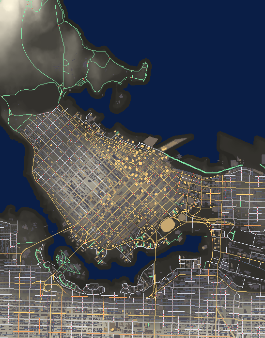

# Vancouver Night Drive

An open-world driving game set in a geometrically accurate Vancouver, built
entirely from the City of Vancouver's open data.



Every street, building and hill is real. Nothing here is hand-modelled:

| What | Source |
|---|---|
| Terrain | 1,256 LiDAR-derived contour lines → 1095×1393 heightfield |
| Roads | 2,983 segments, 295 km, 1,510 junctions |
| Buildings | 10,660 footprints with real LiDAR heights, up to 193.8 m |
| Props | 12,426 street lamps, 337 traffic signals, 25,013 trees |

Currently covers the downtown peninsula — downtown, West End, Coal Harbour,
Yaletown, Stanley Park and across False Creek.

## Running it

```bash
npm install
npm run fetch    # pull open data from the City API (~60 MB, cached)
npm run world    # build terrain, roads and buildings
npm run dev      # http://localhost:5173
```

`npm test` runs the verification suites.

## Controls

| | |
|---|---|
| `W` `S` / `↑` `↓` | throttle, brake and reverse |
| `A` `D` / `←` `→` | steer |
| `Space` | handbrake |
| `C` | camera — chase / hood / wide |
| `L` | lighting — dusk / night / survey |
| `R` | reset |

## How it works

Two decisions shape everything else.

**The car drives on the terrain heightfield, not on road meshes.** Building
trimesh colliders from generated road ribbons produces seams at every junction
and gaps on the outside of bends. Instead the pipeline *burns* road corridors
into the heightmap along a smoothed longitudinal profile, so collision is a
single seamless heightfield and roads are purely visual. Measured result: 0.8 cm
median cross-slope across the carriageway.

**The road graph is a first-class artifact.** Nodes, one-way flags and signal
positions are serialised to `roadgraph.json` even though nothing consumes them
yet, so AI traffic becomes an extension rather than a pipeline rewrite.

Building windows are computed in the shader from real metres — 3.6 m floors,
3.1 m window pitch — using wall-space UVs and a per-building seed. No textures,
so the whole city is one draw call and storeys line up on every building.

### Pipeline

```
tools/fetch.ts        City open data API → data/raw/*.geojson
tools/build-world.ts  → public/world/{heightmap,water,roads,buildings}.bin
  lib/projection.ts   WGS84 → UTM 10N → world metres
  lib/terrain.ts      contours → heightfield (cascadic multigrid)
  lib/roads.ts        centrelines → graph → surface geometry
  lib/burn.ts         flattens road corridors into the terrain
  lib/buildings.ts    footprints → extrusions
```

Terrain is solved with cascadic multigrid: gaps over open water exceed a
kilometre, so relaxing directly on the fine grid would need ~100,000 iterations.
Seven levels does it in about a second.

## Notes on the data

- `webtransfer.vancouver.ca` sits behind Cloudflare and 403s scripted requests,
  so the 2013 DEM raster and raw LiDAR tiles are manual downloads. Everything
  else comes from the Opendatasoft API, unauthenticated.
- Stanley Park Drive is **not** in `public-streets` — the City doesn't own it.
  It lives in `non-city-streets`, along with the causeway.
- `building-footprints-2009` is the only layer carrying heights. It predates
  ~15 years of towers, but its `hgt_agl`, `baseelev_m` and `topelev_m` agree to
  within a centimetre.
- The 2013 LiDAR captured construction excavations as real terrain, leaving pits
  several metres deep mid-block. Depression filling removes them.

## Stack

Three.js, Rapier (raycast vehicle), Vite, TypeScript.
